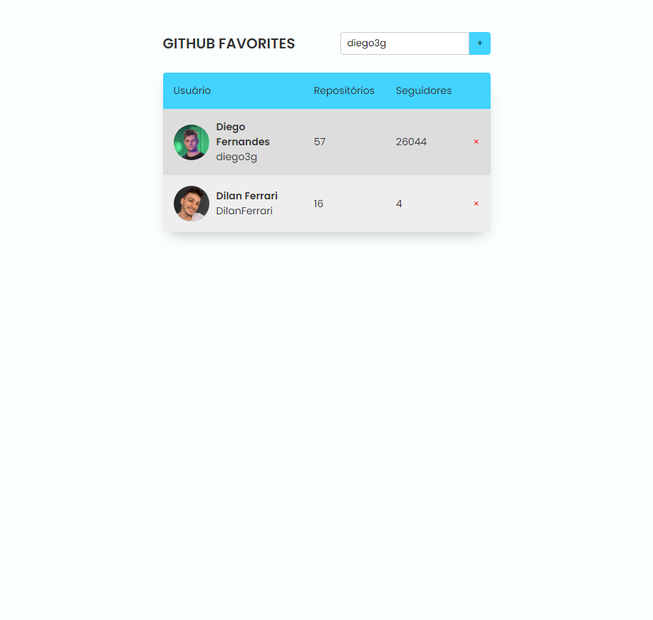

<h1 align="center"> Github Favorites </h1>

Projeto desenvolvido no curso Explorer da Rocketseat.

  <a href="#-tecnologias">Tecnologias</a>&nbsp;&nbsp;&nbsp;|&nbsp;&nbsp;&nbsp;
  <a href="#-projeto">Projeto</a>&nbsp;&nbsp;&nbsp;|&nbsp;&nbsp;&nbsp;
  <a href="#-layout">Layout</a>&nbsp;&nbsp;&nbsp;|&nbsp;&nbsp;&nbsp;
  <a href="#-contato">Contatos</a>

  

## 🚀 Tecnologias

Esse projeto foi desenvolvido com as seguintes tecnologias:

- HTML
- CSS
- JavaScript
 

## 💻 Projeto

O Github Favorites é um projeto desenvolvido no stage 6 da trilha explorer da rocketseat, o objetivo dele é criar um simples sistema aonde você pode adicionar os seus usuarios favoritos do Github, usando javascript puro para adicionar e mantendo o cache para que não seja limpo quando recarregar.
 

## 📱 Contato

dilanferrari@hotmail.com  
<a>https://www.linkedin.com/in/dilanferrari/</a>